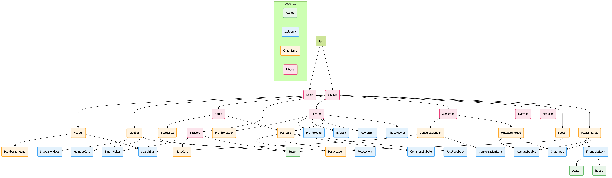

# Caralibro TP2 — Facebook 2010 Clone


**Deploy:** https://caralibrotp2.vercel.app/

---

## Consigna del TP2

Desarrollar una **Single Page Application (SPA)** con React + Vite que replique la interfaz de Facebook 2010, aplicando los siguientes conceptos:

- **Componentización con Atomic Design:** separar la UI en átomos, moléculas y organismos reutilizables
- **Consumo de APIs públicas:** integración de al menos dos APIs con manejo de estados loading, error y datos
- **Persistencia de datos:** uso de localStorage para posts y notas
- **Interactividad:** likes, comentarios, chat con auto-respuesta, RSVP en eventos
- **Responsive Design:** adaptación a mobile con hamburger menu y layout flexible
- **Estética retro:** animaciones sutiles (<200ms), paleta Facebook 2010, tipografía de sistema

### Árbol de Renderizado

El siguiente diagrama muestra la jerarquía de componentes del proyecto, organizados por su clasificación en Atomic Design:



---

## Descripción

SPA desarrollada con React + Vite que recrea la experiencia visual e interactiva de Facebook circa 2010. Incluye muro de posts con imágenes y emojis, mensajería con auto-respuesta, perfiles de equipo y personajes famosos, bitácora de desarrollo persistida en localStorage, eventos con RSVP, y una página de noticias que consume APIs públicas (feriados, cotizaciones, clima). Diseño responsive con estética retro auténtica (bordes cuadrados, azules #3b5998, tipografía sistema, transiciones de 150-200ms).

---

## Integrantes

- Vanesa Aracena – https://github.com/vaneara
- Tomás Maldocena – https://github.com/tmaldocena
- Fernando Rodríguez – https://github.com/Ferchulobo777

---

## Tecnologías Utilizadas

- React 19 + Vite 8
- react-router-dom (navegación SPA declarativa)
- Atomic Design (arquitectura de componentes en atoms / molecules / organisms)
- CSS vanilla con variables + media queries
- localStorage (persistencia de posts, notas y datos de sesión)
- ArgentinaDatos API (feriados 2026, cotizaciones USD/EUR/BRL)
- Open-Meteo API (clima actual de San Juan, Mendoza, San Luis, Buenos Aires)

---

## Estructura de Archivos

```
src/
├── assets/img/               # Imágenes del equipo (avatares, logos)
├── components/
│   ├── atoms/                # Bloques fundamentales
│   │   ├── Avatar.jsx        # Imagen/iniciales, 6 tamaños, link wrapper
│   │   ├── Button.jsx        # Variantes primary/secondary
│   │   ├── Input.jsx         # text/search/textarea/chat variants
│   │   ├── Badge.jsx         # Contador de notificaciones
│   │   └── ...               # Timestamp, Icon
│   ├── molecules/            # Combinaciones de átomos
│   │   ├── SearchBar.jsx     # Input de búsqueda controlado
│   │   ├── MessageBubble.jsx # Burbuja de chat (propio/recibido)
│   │   ├── ChatInput.jsx     # Input con Enter-to-send
│   │   ├── PostActions.jsx   # Like/Comentar/Compartir toggles
│   │   ├── CommentBubble.jsx # Avatar + nombre + texto
│   │   ├── ConversationItem.jsx, FriendListItem.jsx
│   │   ├── SidebarWidget.jsx, InputField.jsx
│   │   ├── EmojiPicker.jsx, PhotoViewer.jsx
│   │   └── ...
│   └── organisms/            # Secciones complejas
│       ├── PostCard.jsx      # Post completo con imágenes carrusel
│       ├── StatusBox.jsx     # Crear post con imágenes + emojis
│       ├── NoteCard.jsx      # Nota de bitácora
│       ├── ConversationList.jsx, MessageThread.jsx
│       ├── ProfileHeader.jsx, ProfileMenu.jsx, InfoBox.jsx
│       ├── Header.jsx, Sidebar.jsx, Footer.jsx
│       ├── FloatingChat.jsx, HamburgerMenu.jsx
│       └── ...
├── data/
│   ├── miembros.js           # Datos completos del equipo (info, habilidades, pelis)
│   └── famosos.js            # 25 personajes famosos con imágenes Wikipedia
├── pages/                    # Vistas principales
│   ├── Home.jsx              # Muro con posts, imágenes, comentarios
│   ├── Login.jsx             # Login progresivo con credenciales pre-cargadas
│   ├── Perfiles.jsx          # Perfiles de equipo + famosos + buscador
│   ├── Mensajes.jsx          # Chat responsive (lista/thread mobile)
│   ├── Bitacora.jsx          # Notas del proyecto (persistidas + documentación)
│   ├── Eventos.jsx           # Evento TP2 con RSVP
│   └── Noticias.jsx          # APIs: feriados, cotizaciones, clima
├── App.jsx                   # Router principal
└── styles/
    └── main.css              # Único stylesheet (~1900 líneas)
```

---

## Guía de Estilos

### Paleta de Colores

| Color | Hex |
|-------|-----|
| Azul principal | `#3b5998` |
| Azul hover | `#4267b2` |
| Fondo de página | `#e9ebee` |
| Bordes de tarjetas | `#dddfe2` |
| Texto principal | `#1c1e21` |
| Texto secundario | `#606770` |
| Blanco tarjetas | `#ffffff` |
| Verde éxito | `#609846` |

### Tipografía

Fuente nativa del sistema (sin Google Fonts):
```
font-family: system-ui, 'Segoe UI', Roboto, Helvetica, Arial, sans-serif;
```

### Iconografía

Emojis nativos — sin librerías externas.

---

## JavaScript / React — Funcionalidades implementadas

### Muro interactivo (Home)
- Posts con texto, imágenes (subidas por el usuario), emojis, comentarios en vivo
- Toggle Like (Me gusta / Ya no me gusta) y Compartir (Compartir / Compartido)
- Comentarios con Enter o botón, equipo comenta automáticamente en posts nuevos
- Persistencia en localStorage


### Visor de fotos (PhotoViewer)
- Modal carrusel con navegación ‹/›, teclado (← → Escape)
- Integrado en perfiles (fotos del usuario) y en home (imágenes de posts)

### Mensajería (Mensajes + FloatingChat)
- Conversaciones con auto-respuesta de emojis aleatorios tras 1-2s
- Vista responsive mobile: lista de chats → al tocar uno, se abre el thread con botón ←

### Perfiles dinámicos
- Tabs funcionales: Muro, Información, Fotos, Más
- 3 miembros del equipo con datos completos (películas, música, habilidades, amigos)
- 25 personajes famosos con imágenes de Wikipedia, buscador por nombre + filtro por categoría

### Login progresivo
- Filas que aparecen una tras otra con delays crecientes (simula internet lento)
- Campos pre-cargados con credenciales "visitante"
- Responsive mobile: formulario se apila verticalmente

### Noticias con APIs públicas
- **Feriados 2026:** paginación client-side (5 por página)
- **Cotizaciones:** USD, EUR, BRL con compra/venta
- **Clima:** San Juan, Mendoza, San Luis, Buenos Aires (grid 2×2)
- Estados loading (skeleton pulse), error (con Reintentar), Promise.all para fetch paralelo

### Eventos
- Página del TP2 con fecha límite (1 de julio de 2026)
- RSVP: Asistiré / Tal vez / No asistiré con foto del equipo

### Bitácora
- Notas del proyecto persistidas en localStorage
- Documentación estática: migración a React, roles del equipo, integración de APIs, animaciones

### Buscador global
- Busca en miembros + famosos en vivo desde el header
- Dropdown con resultados cliqueables que navegan al perfil

### Responsive
- Breakpoints: 900px (grid 1 columna, hamburger visible), 600px (compacto), 400px (minimal)
- Hamburger menu fullscreen estilo Facebook Java
- Mensajes con vista stack mobile (lista/thread)

### Animaciones vintage
- Hover en tarjetas: sombra + translateY(-1px) — 150ms
- Like: escala (like-pop) — 200ms
- Mensajes nuevos: fade-up (msg-in) — 200ms
- Tabs de perfil: fade-in — 200ms
- Transición entre páginas: fade + translateY(8px) — 250ms
- Sin easing moderno, sin rotaciones 3D, sin brillos

---

## Enlace al Proyecto Desplegado

[https://caralibrotp2.vercel.app/](https://caralibrotp2.vercel.app/)

---

## Evolución del Proyecto

### TP1 → TP2

| Antes (HTML estático) | Ahora (SPA React) |
|----------------------|-------------------|
| Archivos HTML duplicados (index, bitacora, perfil) | Componentes reutilizables con Atomic Design |
| CSS fragmentado (main.css + responsive.css) | Único stylesheet con variables y media queries |
| JavaScript plano con funciones sueltas | Estado React con hooks, persistencia localStorage |
| Sin routing — recarga completa en cada página | react-router-dom con navegación declarativa |
| Sin APIs | Consumo de ArgentinaDatos + Open-Meteo con loading/error |

### Capturas


*Home — Vista de Login*


*Muro de posts con imágenes, emojis y comentarios*


*Vista responsive mobile — menú hamburguesa y layout adaptativo*

---

## Uso de Inteligencia Artificial

### Modelos utilizados

- *OpenCode Big Pickle, Claude Sonnet 4.6, ChatGPT-4.0 (Gepetto para los amigos)*

### Uso en contenido y código

- **Textos generados:** Documentación de la bitácora (justificación de migración, roles del equipo, integración de APIs, animaciones), descripciones de personajes famosos, contenido de posts semilla
- **Código:** Asistencia en debugging de componentes (PostCard, FloatingChat, auto-merge de estados), generación de estructura de datos (famosos, miembros), implementación de animaciones CSS vintage, responsive design con media queries, resolución de conflictos de merge en Git
- **Debugging:** Identificación de errores de estado en componentes, problemas de re-renderizado, conflictos entre localStorage y estado inicial

### Imágenes generadas con IA

- Algunos avatares e imágenes de perfil fueron generados utilizando herramientas de IA generativa.

---

## Cómo correr el proyecto localmente

```bash
npm install
npm run dev
```

---

**Curso:** Frontend — TP2  
**Comisión:** 2° E  
**Equipo:** Grupo 4
